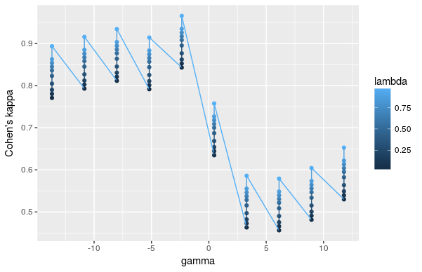
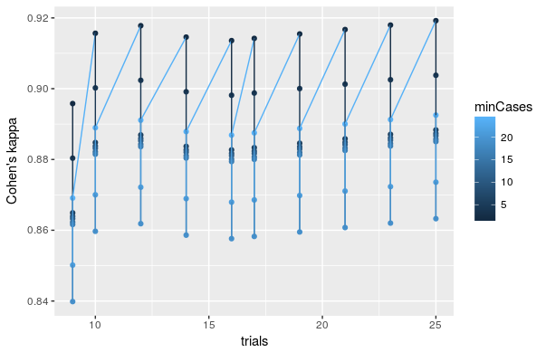
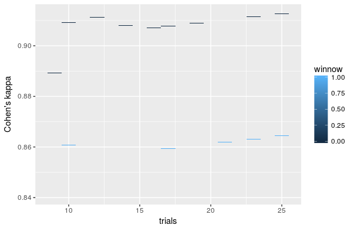

# hedgeable_ads
Contains Hedgeable Machine Learning Assignment For Prediction

From the Instructions:

***

## Problem
Using a data set of past advertisements on the Internet, can we accurately predict what image will be an advertisement based on attributes of that image?

## Project
The features encode the geometry of the image (if available) as well as phrases occurring in the URL, 
the image's URL and alt text, the anchor text, and words occurring near the anchor text.

Number of Instances: 3,279 (2,821 non ads, 458 ads)

Number of Attributes: 1,558 (3 continuous; others binary)

28% of instances are missing some of the continuous attributes.

Missing values should be interpreted as "unknown"

Class Distribution- number of instances per class: 2,821 non ads, 458 ads.

The task is to predict whether an image is an advertisement ("ad") or not ("non ad").

## Deliverables
Please send us the following:

1. Code, and associated files, used for the project. You can send us a zipfile, or upload the project to a public github repo.
2. The algorithm you developed to make your predictions
3. How we can run the algorithm on a test data set
4. The process you used to analyze the data and came to your conclusions

***

## Folder Description

The files and folders in this repository contain the code and associated files to predict whether an image is an ad based on its underlying properties. In each folder are:

1. data
 - The data and meta data for advertisements
2. tuning_scripts
 - The code to tune the data
 - tuning_missing: contains the code to build the model which imputes missing data. Because of time constraints a model was built to impute height, and because width and aratio are most likely strongly correlated with height the tuned parameters from the ctree model used to predict height were also used to build the width and aratio models. the local variable was a binary variable and, due to time constraints, a histogram imputation strategy is used to calculate random values to impute into local.
 - tuning_ads: contains the code to impute and tune the C5.0 and hdrda models
 - tuning_c50: contains code to tune a C5.0 model that also tunes the threshold for the hard prediction of ad vs. nonad. Due to time constraints this was not run, but is given to show how a better model could be built.
2. models
 - The final models created from the tuning and training routine as well as the tuning objects and imputation objects.
 - *_train_mod: the final tuned model for the given task
 - *_tune_mod: the tuning object returned from mlr. This is mostly used to analyze how the model reacted to new hyperparameters. height_tune is used to build the imputation models in tuning_ads and tuning_c50
3. img
 - Contains pictures that analyze the respective tuning object hyperparameters
4. analysis
 - Code used to generate analysis
5. predict
 - Contains script that can be used to predict with new data for the C5.0 and hdrda model
 
## Requirements

Code is written in `R` and requires the packages `mlr`, `parallelMap`, and `data.table`. The models used require the packages `C50`, `hdrda`, `party` and `randomForest`. Tuning is performed in parallel and so the number of cores in `parallelStartSocket()` should be changed for your particular computer.

## Data

This section uses code from `tuning_ads` up until line 37. The provided data is wrapped into a `ClassifTask` using the package `mlr`. The classification task is the building block for the rest of the functions in `mlr` and contains meta-information for the data.

```r
ad_task

# Supervised task: Hedgeable Ad Identification
# Type: classif
# Target: classes
# Observations: 3179
# Features:
# numerics  factors  ordered 
#     1558        0        0 
# Missings: TRUE
# Has weights: FALSE
# Has blocking: FALSE
# Classes: 2
#    ad. nonad. 
#    442   2737 
# Positive class: ad.
```

With some variables having NA's there are three possible routes

1. Remove all NA observations and only use the observations with complete cases
2. Use a model that accounts for NA's in the training data inherently
3. Use an imputation method on the observations with NAs, then use the imputed data to train the final model.

The first route has the draw back that our model will be unable to make predictions for data which has any NAs. (2) will work, but will limit the types of models we are allowed to employ. This analysis chooses (3) and builds a `ctree` model to predict the continuous variables while generating random values with probabilities calculated from the variables histogram for binary variables.

An imputation method is used on the data for the variables `height`, `width`, `aratio`, and `local` which creates a new task labeled `impute_ad_task`. A Conditional Inference Tree model is used to develop imputations for the continuous variables with missing data as it is a simple model that is known to produce quick and reasonable results. More information on the inner workings of `ctree` can be found in the details of the help file [`?party::ctree()`] Model development for the imputation technique can be viewed in the file marked `tuning_missing` in the folder `tuning_scripts`.


The `mlr` package's `impute()` function has a reproducible benefit, in that imputation can be easily performed on testing data by simply calling `reimpute()` [line 40]. For our purposes, 100 observations were randomly chosen to be the final holdout data that our models will be assessed on at the end of the tuning procedure.

```r
impute_ad_task

# Supervised task: Hedgeable Ad Identification
# Type: classif
# Target: classes
# Observations: 3179
# Features:
# numerics  factors  ordered 
#     1558        0        0 
# Missings: FALSE
# Has weights: FALSE
# Has blocking: FALSE
# Classes: 2
#    ad. nonad. 
#    442   2737 
# Positive class: ad.
```
Notice also that the data has a class imbalance, with 442 advertisements and 2737 non-advertisement images. While oversampling and undersampling techniques such as [smote](https://www.jair.org/media/953/live-953-2037-jair.pdf) were tested, it was not found that correcting for class imbalance produced a better model.

## Models

Two models were tuned over the imputed data.

1. C5.0 ([wiki](https://en.wikipedia.org/wiki/C4.5_algorithm))
- A tree/rule based model whose branching procedure is based on the split which maximizes the information gain. This model has a [boosting](https://en.wikipedia.org/wiki/Boosting_(machine_learning)) procedure which stacks previous trees on top of one another.

2. hdrda ([paper](https://arxiv.org/pdf/1602.01182v1.pdf))
- High Dimensional Regularized Discriminant Analysis. Good for small sample high dimensional settings.

## Results

Both models were tuned with [b632+](http://stats.stackexchange.com/questions/96739/what-is-the-632-rule-in-bootstrapping) for 10 iterations with an objective to maximize [Cohen's Kappa](https://en.wikipedia.org/wiki/Cohen's_kappa) where the best model would have a score of one. Iterated [F-Racing](http://iridia.ulb.ac.be/irace/) with a maximum number experiments equal to 250 is used to search the hyperparameter space. The below table gives results for the tuning and holdout set kappa scores of both models.

| Model         | Train          | Test     |
| ------------- |:-------------:| ---------:|
| C5.0          | 0.918         | 0.9005305 |
| hdrdra        | 0.912         | 0.9681529 |


The final models selected were.

```r
tune_mod_c50

# Tune result:
# Op. pars: trials=25; minCases=7; rules=TRUE; winnow=FALSE; noGlobalPruning=TRUE; CF=0.262
# kappa.b632plus=0.918
```

```r
tune_mod_hdrda

# Tune result:
# Op. pars: lambda=0.958; gamma=0.00312
# kappa.b632=0.912
```

### Analysis of Models

hdrda has only two parameters to tune, gamma and lambda. Below is the dependency plot of gamma and lambda, with the x axis being gamma, y being within tuning kappa, and the color of the line graph being lambda. It is clear the value of gamma had a much stronger effect on the model's end kappa score, with kappa increasing as lambda increased.



The images below contain the dependency graphs for some of the tuning parameters for C5.0. The first graph shows the minimum number of cases needed to make a split as the line color while the x axis is the number of boosting trials and y is the kappa value within tuning. It appears that the minimum number of cases had a much stronger effect relative to the number of trials, causing what looks like a large variance in our graphic.




The graphic below shows the number of trials and whether the model allowed winnowing, where winnowing the C5.0 model's process of filtering out what it deems to be useless features. We can see in the graphic that the best models actually had no winnowing, meaning that while some variables are usually not used, at some points they may be useful.



## Prediction

To predict with new data, used the script located in the predict folder. The only part of the file that should need to be changed is the name of the data in the `fread()` function.

While hdrda outperformed C5.0 on the test data, my final recommendation is to use C5.0 as it tends to perform more consistently on out of sample data. 

## Future

Future iterations of this model could use [ensembles](https://rdrr.io/cran/mlr/man/makeStackedLearner.html) of several models, which would most likely outperform either of the individual models created here. While this is very feasible in mlr, due to time constraints and a long tuning time for the ensembled model this was not feasible for this project.

Another upgrade that would be simple with more time would be to impliment a better model for the imputation. Currently we are only using the tuning parameters when targeting height to train the models to predict width, and aratio. With more time we would be able to build models which would give us more accurate imputation, providing better data for C5.0 and hdrda.

Finally, the 250 experiments that were used to run the iterated F-racing is a minimun number. 400 to 700 experiments would allow the optimization process to search a much wider space and give better model results.

